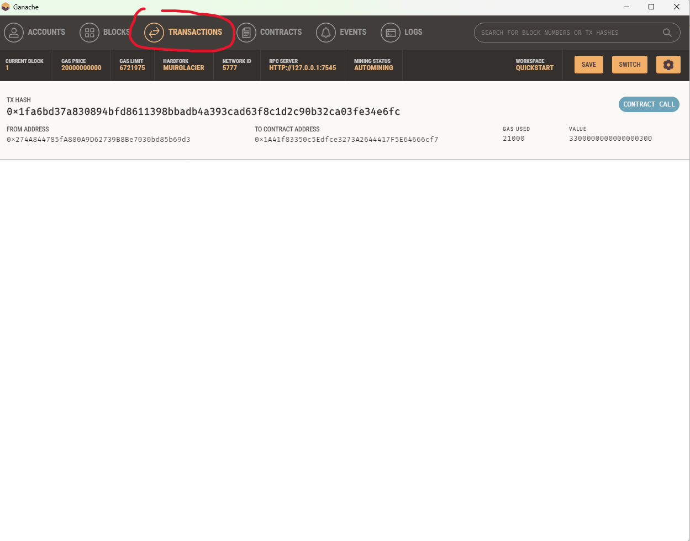
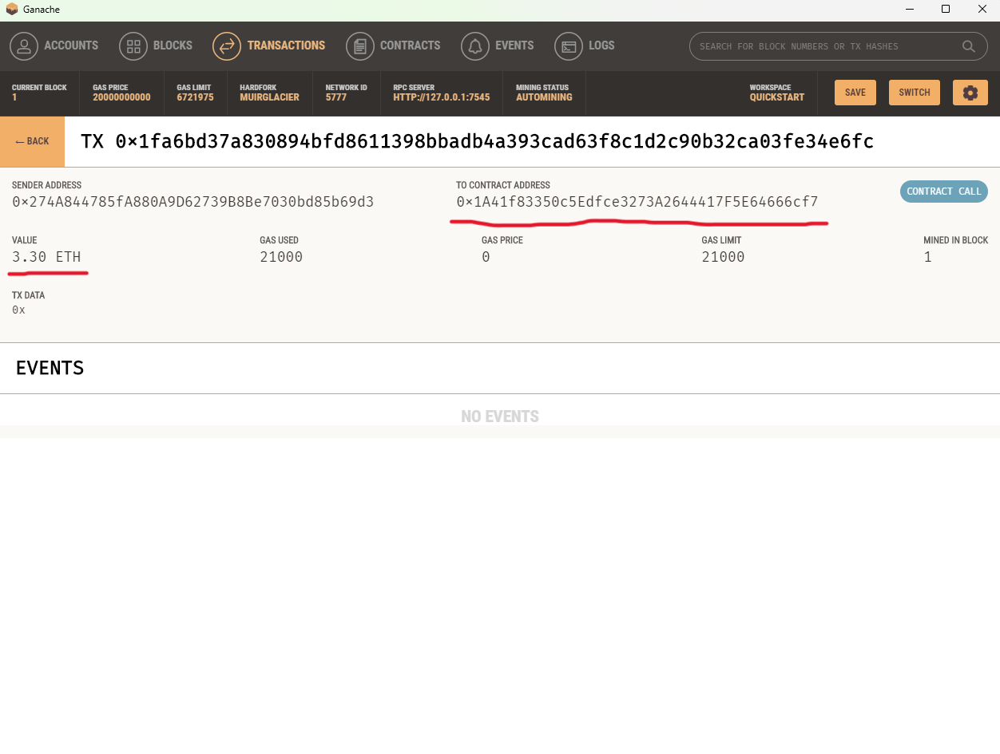

# Unit-19-Cryptocurrency-Wallet

## Purpose

Enables customers to send cryptocurrency payments to fintech professionals from a list of candidates.

## Example
1. Select ***Ash*** to hire from the drop-down menu.  
2. Select the number of hours (***10***) to hire. 
3. Display Total wage ***3.3*** ETH
4. Send transation with ***validated transation hash***

## Opening Balance

> Customer account number, balance = 100 ETH (***top one***)

> Candidates account numbers, balance = 100 ETH(***yellow box***)

## Send Transaction to sign and send the transaction

> Customer account balance drop by ***3.3*** ETH

> Customer account history - ***one transfer*** made

> Customer account transation details

## Recipient's balance and History

> Ash's account balance(increased by ***3.3*** ETH)

> Ash's history (***To Contract Address*** received 3.3 ETH)

